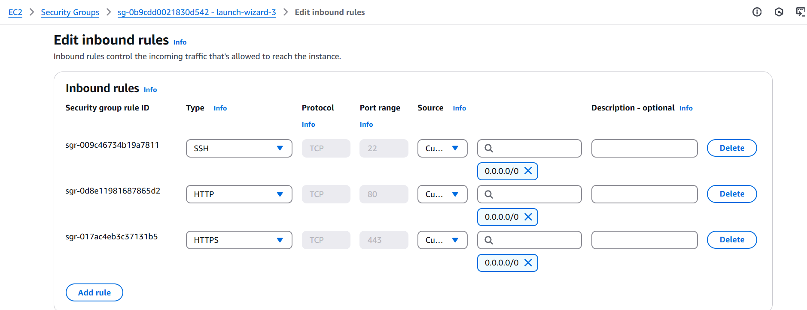

# Welcome to Samkeliso-Dube's Landing Page

Welcome! You’ve stumbled upon the deployment guide of a simple web-project .This will walk you through the provisioning a Linux server, setting up a web server ,and taking you to the landing page

## **Project Overview**

In this project, you will:

1. Set up a Linux server using a cloud platform like AWS.
2. Install and configure a web server (e.g., Apache or Nginx).
3. Create and deploy a personal HTML landing page with your details.
4. Configure networking to make your page accessible online.
5. Encrypt the traffic using the SSL certificate

**Let's get started!!!**

## 1. **Provision the Server**

### Steps:

1. Log in to your preferred cloud platform (AWS, Azure, or GCP).
2. Create a new virtual machine (VM) or instance and select **Linux** as the OS (e.g., Ubuntu).
3. Configure SSH access and note your server’s public IP address.

## 2. **Setting Up the Web Server**

- Connect to your Linux instance via SSH

```bash
ssh your-username@your-server-ip
```

- Update the server packages with:

```bash
sudo apt update
sudo apt upgrade
```

- Install apache

```bash
sudo apt install apache2 -y
```

- Start and enable apache

```bash
sudo systemctl start apache2
sudo systemctl enable apache2
```

- Verify Apache is Up and running

```bash
sudo service apache2 status
```


Congratulations Apache is Running!!!!!

Test Apache2 in the Browser

```bash
copy and paste the public ip of your instance
```


Should display the Apache Default page

## 3. **Creating the Landing Page**

Deploy a simple index.html page that includes:

- **My name**
- **A project title**: (e.g Welcome to Samkeliso-Dube's Landing)
- **A brief description of the project**
- **Bio** (
  This page is the first thing anyone will see when they visit the server, and it shows the potential of what our startup can do.)

### Steps:

- Switch to the root user

```bash
  sudo su -
```

- Navigate to the folder with the html file

```bash
cd /var/www.html
```

- List the contents inside the directory

```bash
ls
```

- Edit the file

```bash
nano index.html
```

- Save and exit

## **Networking**

- Allow HTTP **port 80** traffic through the firewall:
  

- Test your server’s accessibility by entering your server’s public IP address into a web browser.
  

**_This Traffic is un-encrypted_**

- Lets Get a domain and encrypt the traffic

- Navigate to https://freedns.afraid.org/ get a free domain

- Map it with the server's public IP


- Should look like this (**_still unencrypted_** )

### Lets encrypt!!!

## **Configuring HTTPS**

- **Add HTTPS**: Secure your site using Let’s Encrypt.
- **Custom Domain**: Link your site to a domain name for easier access

## **Steps Taken:**

- Install certbot for apache:

```bash
sudo apt install certbot python3-certbot-apache -y
```

- Configure https with lets encrypt:

```bash
sudo certbot --apache
```

- Certificate release:
  

Congratulations !!!!

Test your certificate on your browser


## How to View My Landing Page

You can view my simple html landing page here:
_https://web.sammy.mooo.com_

Simply copy-paste it into any web browser, and you’ll see the page in action!
